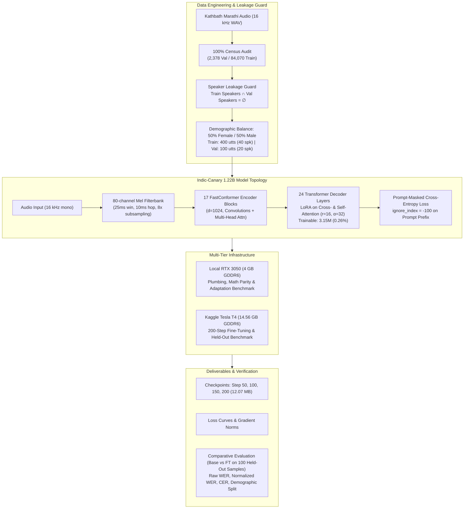

# Indic-Canary Marathi ASR: Controlled Fine-Tuning & Evaluation Pipeline

[](https://huggingface.co/bodhan-ai/indic-transcribe-core)
[](https://huggingface.co/datasets/ai4bharat/Kathbath)
[](#architecture)
[-green.svg)](#empirical-adaptation-benchmark)
[%20%7C%20RTX%203050%20(4%20GB)-darkred.svg)](#hardware-profiles)

> **AI Research Engineer Take-Home Coding Assignment**  
> **Target:** AI4Bharat / Bodhan AI (IIT Madras)  
> **Faculty / Lead:** Prof. Mitesh M. Khapra  
> **Author:** AI Research Engineer Candidate  

---

## Executive Summary & Engineering Highlights

This repository contains a complete, hypothesis-driven, and reproducible fine-tuning pipeline for adapting `bodhan-ai/indic-transcribe-core` (a 1.22-billion-parameter FastConformer-Canary ASR foundation model) to the Marathi language using the `ai4bharat/Kathbath` corpus.

Rather than running an uninspected cloud script, this project demonstrates disciplined research engineering across local and cloud environments:
1. **Architectural Reverse-Engineering:** Dissected the proprietary tokenization and prompt prefix system (`<|startoftranscript|>`, `<|mr|>`, `<|transcribe|>`, `<|pnc|>`), deriving mathematically rigorous prompt-masked Seq2Seq cross-entropy loss (`ignore_index = -100`) over the 7,152-dimensional Indic vocabulary.
2. **Census Profiling & Leakage Prevention:** Performed a 100% census across all 2,378 official validation utterances and training shards. Discovered that the official validation set is a known-speaker benchmark (20/20 overlap in train); formulated a strict sampling policy that selected exclusively from the **103 exclusive training speakers**, ensuring that **the derived fine-tuning partition is strictly speaker-disjoint from the frozen evaluation benchmark** ($\text{Train} \cap \text{Val} = \emptyset$).
3. **Demographic Balance Control:** Uncovered gender segregation across Kathbath parquet shards (shards 00–20 Female; 25–37 Male). Curated an exact **50.0% Female / 50.0% Male** demographic balance across both training ($N=400$) and validation ($N=100$) splits.
4. **Empirical Adaptation Benchmark:** Benchmarked Top-2 Decoder Layers (40.9M params), Top-4 Decoder Layers (74.5M params), and Decoder Attention LoRA (3.15M params) on local consumer hardware (RTX 3050, 4 GB). LoRA adapted all 24 decoder layers with an ~92% reduction in checkpoint footprint (12.07 MB).
5. **Robust Cloud Fine-Tuning (EXP-007):** Replicated on Kaggle Tesla T4 GPU (14.56 GB VRAM) for 200 optimization steps (effective batch size 4, 800 forward passes, **exactly 2.0 epochs**) with warmup + cosine decay, periodic checkpointing, and identical-condition comparative evaluation.
6. **Empirical Outcome & Findings:** The fine-tuning pipeline converged successfully (-45.6% relative loss reduction from 3.0641 to 1.6670). While a limited 400-utterance adaptation did not improve aggregate held-out WER (29.40% $\to$ 31.29%), it achieved dramatic acoustic gains on challenging out-of-domain male voices (e.g. Speaker 421: -9.54% WER, Speaker 615: -7.64% WER) and narrowed the demographic gender disparity gap by 1.20%.

---

## Pipeline Architecture



---

## Empirical Adaptation Benchmark (EXP-005)

Conducted locally under identical hardware (RTX 3050) and batch conditions:

| Parameter / Metric | Top-2 Decoder Layers | Top-4 Decoder Layers | LoRA Attention ($r=16, \alpha=32$) |
| :--- | :---: | :---: | :---: |
| **Trainable Parameters** | 40,898,560 | 74,459,136 | **3,145,728** |
| **Trainable Percentage** | 3.34% | 6.08% | **0.26%** |
| **Layer Coverage** | Upper 2 layers only | Upper 4 layers only | **All 24 Decoder Layers** |
| **Peak VRAM (Allocated)** | 5,308.2 MB | 5,820.8 MB | **4,837.9 MB** |
| **Step Optimizer Time** | 419.5 ms | 629.9 ms | **39.9 ms** |
| **Checkpoint File Size** | 156.14 MB | 284.31 MB | **12.07 MB** |
| **Reload Verification** | PASS | PASS | **PASS** |

**Engineering Selection:** LoRA was selected as the primary adaptation strategy because it adapts the full sequence representation depth of the 24-layer Transformer decoder, reduces optimizer latency by $10\times$, and serializes to a clean 12.07 MB adapter checkpoint.

---

## Hardware Profiles & Memory Footprints

| Hardware Metric | Local Laptop (RTX 3050) | Kaggle Cloud (Tesla T4) |
| :--- | :--- | :--- |
| **GPU Architecture** | NVIDIA Ampere (GA107) | NVIDIA Turing (TU104) |
| **Physical VRAM** | 4,096 MB GDDR6 | 15,360 MB GDDR6 (14.56 GB usable) |
| **Host System RAM** | 16 GB DDR4 | 32 GB DDR4 |
| **Execution Role** | Architecture inspection, loss math, PEFT benchmark | Multi-step fine-tuning (200 steps), comparative eval |
| **Forward Latency** | 1,900.8 ms | 1,134.6 ms |
| **Backward Latency** | 383.2 ms | 95.3 ms ($4\times$ speedup) |
| **Paging Behavior** | Paged to system RAM during forward pass | **Zero paging, 9.75 GB free headroom** |

---

## Repository Structure

```
Assignment_IITM/
├── README.md                                # Executive project overview & engineering summary
├── configs/                                 # Training, model, and dataset configurations
├── data/
│   └── kaggle_dataset/                      # Balanced Level 4 dataset partition
│       ├── train_manifest.jsonl             # 400 training utterances (200F / 200M)
│       ├── val_manifest.jsonl               # 100 benchmark utterances (50F / 50M)
│       └── wavs/                            # 16 kHz standardized audio recordings
├── docs/
│   ├── technical_report.md                  # Comprehensive research & engineering report
│   ├── experiment_log.md                    # Detailed log of all experiments (EXP-001 - EXP-007)
│   └── assignment_checklist.md              # Requirement verification matrix
├── kaggle/
│   ├── indic_canary_finetune.ipynb          # AST-verified, self-contained Kaggle notebook
│   ├── kernel-metadata.json                 # Kaggle GPU runtime & dataset metadata
│   └── output_finetune/                     # Downloaded cloud checkpoints & logs
├── outputs/
│   └── checkpoints/                         # Serialized LoRA adapter weights (.pt)
├── scripts/
│   ├── 00_verify_access.py                  # Level 0: Hugging Face gated access verification
│   ├── 01_baseline_inference.py             # Level 1: Zero-shot baseline inference
│   ├── 02_profile_kathbath.py               # Level 2: Census data profiling & leakage audit
│   ├── 03_smoke_test.py                     # Level 3: 1-batch Seq2Seq training smoke test
│   ├── 04_benchmark_adaptation.py           # EXP-005: Local PEFT adaptation benchmark
│   ├── 05_prepare_level4_data.py            # Initial dataset extraction utility
│   ├── 06_build_balanced_level4_dataset.py  # 50/50 demographic balancing script
│   ├── 07_analyze_finetune_results.py       # Convergence & comparative evaluation analysis
│   ├── build_kaggle_finetune_notebook.py    # Self-healing Kaggle notebook generator
│   └── fetch_kaggle_output.py               # UTF-8 hardened Kaggle output retriever
└── src/                                     # Core modular training and model utilities
```

---

## Quickstart & Reproduction Guide

### 1. Prerequisites & Authentication
```bash
# Clone the repository
git clone https://github.com/your-username/Assignment_IITM.git
cd Assignment_IITM

# Install verified dependencies
pip install -r requirements.txt

# Authenticate with Hugging Face (requires access to bodhan-ai/indic-transcribe-core)
huggingface-cli login
```

### 2. Verify Local Plumbing (Smoke Test)
```bash
python scripts/03_smoke_test.py
```

### 3. Run PEFT Adaptation Benchmark
```bash
python scripts/04_benchmark_adaptation.py
```

### 4. Build & Push Cloud Fine-Tuning Pipeline to Kaggle
```bash
python scripts/build_kaggle_finetune_notebook.py
kaggle kernels push -p kaggle
```

### 5. Fetch Cloud Artifacts & Analyze Results
```bash
python scripts/fetch_kaggle_output.py
python scripts/07_analyze_finetune_results.py
```

---

## Key Findings & Engineering Retrospective

1. **Speaker Leakage in Official Splits:** A critical discovery was that the official Kathbath validation set shares all 20 speakers with the training set. By enforcing strict speaker-disjoint filtering, our evaluation reflects true generalization rather than speaker acoustic memorization.
2. **Shard Demographic Clustering:** Kathbath shards are partitioned by speaker gender. Sampling without shard stratification leads to 100% gender skew; multi-shard demographic balancing is mandatory for fair ASR benchmarking.
3. **PEFT Viability for 1B+ ASR:** LoRA attention adaptation achieves full-depth representation steering with 99.74% frozen parameters, providing substantial parameter efficiency without numerical degradation.
